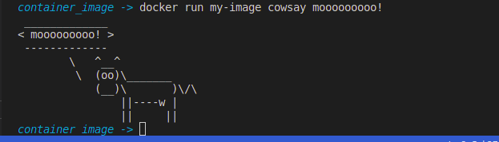

# Bioinformatics Boost: A Roadmap for Biologists
**Ammar Y. Mohamed [LinkedIn](https://www.linkedin.com/in/ammarymo/), [Facebook](https://web.facebook.com/ammarsilva99/)**

## Introduction
If you are a biologist looking to enter the world of **bioinformatics**, you'll need to study some additional subjects and sciences. Fortunately, with abundant online resources, it's easier than ever to learn what you need. Just follow the checklist below to get started!

## Checklist

### Recommended Computer Resources:
- **CPU**: `H` or `HQ` processors from `Intel Core i7` or `i5` (6th generation or higher) or similar processors
- **RAM**: `8 GB`
- **Storage**: At least `256 GB` of free space

*Note: This recommendation is based on personal experience, but don't worry if your specs differ.*

### Optional Tools and Tips - For Studying Purposes:
1. **Obsidian** for note-taking:
   - Download and install: [Official Website](https://obsidian.md/download)
   - [Tutorial](https://youtu.be/hSTy_BInQs8?si=svdEcqmgBFwIfPFw)
2. **GitHub account**
3. **LinkedIn account**
4. OpenAI account for **ChatGPT**
5. Familiarize yourself with [Stack Overflow](https://stackoverflow.com/), [BioStars](https://www.biostars.org/), and [Stack Exchange](https://stackexchange.com/).

## Learning Steps
Follow these steps carefully and aim to understand each one fully.

### Step 1: Fundamentals

#### Statistics and Mathematics
**Start with these topics before diving into programming.**  
*Note: Calculus can be lengthy and challenging, so consider studying it alongside Statistics.*

- **Calculus**: [Khan Academy](https://www.youtube.com/playlist?list=PL19E79A0638C8D449)
- **Statistics**: [StatQuest](https://www.youtube.com/playlist?list=PLblh5JKOoLUK0FLuzwntyYI10UQFUhsY9)
- **Linear Algebra**: [Khan Academy](https://www.khanacademy.org/math/linear-algebra)

#### Programming
Begin by developing foundational computer science skills.

- **C++**:
  - **Free**: [Elzero Web School](https://elzero.org/study/cplusplus-study-plan/)

Afterward, start with a brief introduction to R programming. Choose one of the following courses:
- **Introduction to R Programming**:
  - **Recommended** **Free**: [Tutorials Point](https://www.tutorialspoint.com/r/index.htm)
  - **Recommended** **Paid**: [Introduction to R from AdvanzaBio](https://web.facebook.com/AdvanzaBio)
  - **Free**: [Simplilearn Introduction to R](https://www.youtube.com/playlist?list=PLEiEAq2VkUUKAw0aAJ1W4jpZ1q9LpX4yG)
  - **Free**: [Mohamed Abdelfattah](https://www.youtube.com/@MoAbdalfttah)

Get acquainted with bash scripting:
- **Bash**:
  - **Free** **Read**: [Tutorials Point](https://www.tutorialspoint.com/unix/shell_scripting.htm)
  - **Paid** **Recommended**: [AdvanzaBio](https://web.facebook.com/AdvanzaBio)

Consider learning Python as well, if time permits:
- **Python**:
  - **Recommended** **Free**: [Elzero](https://elzero.org/category/courses/mastering-python/)

*Now you're ready for the next step!*

---

### Step 2: Data Science

At this stage, continue building on your R knowledge (recommended) or use Python if preferred. Here are some resources:

#### For R Users
- **Source 1** **Paid**: [Data Science with R Career Track on DataCamp](https://app.datacamp.com/learn/career-tracks/data-scientist-in-r)
- **Source 2** **Paid**: [AdvanzaBio](https://web.facebook.com/AdvanzaBio)
- **Source 3** **Free** **Read**:
  - [R for Data Science](https://r4ds.had.co.nz/)
  - [Statistical Learning with R](https://www.statlearning.com/)

#### For Python Users
- **Source 1** **Paid**: [Data Science with Python Career Track on DataCamp](https://app.datacamp.com/learn/career-tracks/data-scientist-in-r)
- **Source 2** **Free** **Recommended**:
  - *Book*: *Python for Data Analysis* by Wes McKinney
  - *Book*: *Hands-On Machine Learning with Scikit-Learn, Keras, and TensorFlow* by Aurélien Géron

Any of these sources is fine, depending on your preference.

---

### Step 3: Bioinformatics

Now that you have a solid foundation, you're ready for a strong start in **bioinformatics**. Bioinformatics is a diverse field, so there’s no one-size-fits-all roadmap. After some introductory courses, you can choose a specific area to focus on (e.g., Genomics, Transcriptomics).

- **Introduction to Bioinformatics and Computational Biology**:  
  This course covers a broad range of bioinformatics topics and is a great starting point. [Course Link](https://liulab-dfci.github.io/bioinfo-combio/)  
  **Note**: This course requires strong statistical and machine learning knowledge, which we covered in Step 1.

Afterward, you can specialize in your chosen field.

--- 

Let me know if you need further refinements!
